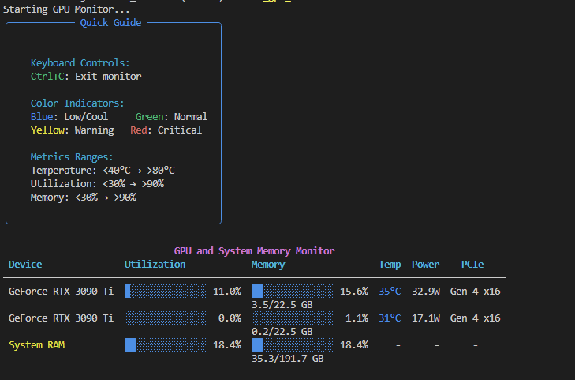

# GPU Monitor

A real-time GPU and System Memory monitoring tool with color-coded visual indicators.



## Project Structure

```directory
GPU_monitor/
├── src/                # Source code
│   └── monitor_gpus.py # Main application file
├── scripts/            # Utility and test scripts
│   ├── run_gpu_monitor.bat
│   ├── run_tests.bat
│   ├── test_monitor_gpus.py
│   └── toggle_gpu.bat
├── docs/              # Documentation
├── logs/              # Application and test logs
├── monitor_gpus/      # Virtual environment
├── .gitignore        # Git ignore file
└── requirements.txt   # Project dependencies
```

For detailed project architecture, see [ARCHITECTURE.md](ARCHITECTURE.md).

## Features

- Real-time monitoring of GPU metrics:
  - Utilization
  - Memory usage
  - Temperature
  - Power consumption
  - PCIe information
- System RAM monitoring
- Color-coded indicators for quick status assessment:
  - Blue: Low utilization/temperature
  - Green: Normal operation
  - Yellow: Warning level
  - Red: Critical level
- Configurable refresh rates
- Support for multiple GPUs
- Automated test suite with coverage reporting
- Comprehensive logging with timestamps and process IDs

## Requirements

- Python 3.6+
- NVIDIA GPU(s)
- NVIDIA drivers installed
- Windows OS (batch scripts are Windows-specific)

## Quick Start

1. Clone the repository:

```cmd
git clone https://github.com/Xza85hrf/gpu-monitor.git
cd gpu-monitor
```

2. Run the setup script:

```cmd
scripts/run_gpu_monitor.bat
```

This will:

- Create a virtual environment
- Install required packages
- Start the GPU monitor

## Manual Installation

1. Create and activate virtual environment:

```cmd
python -m venv monitor_gpus
monitor_gpus\Scripts\activate
```

2. Install required packages:

```cmd
pip install -r requirements.txt
```

3. Run the monitor:

```cmd
python src/monitor_gpus.py
```

## Usage

Basic usage:

```cmd
python src/monitor_gpus.py
```

With custom options:

```cmd
# Set custom update interval (in seconds)
python src/monitor_gpus.py --interval 1.0

# Monitor specific GPUs by index
python src/monitor_gpus.py --gpu-indices 0 1

# Set custom refresh rate
python src/monitor_gpus.py --refresh-rate 0.5
```

## Color Indicators

### Temperature

- Blue: < 40°C (Cool/Ideal)
- Green: 40-60°C (Normal)
- Yellow: 60-80°C (Warning)
- Red: > 80°C (Critical)

### Utilization

- Blue: < 30% (Light load)
- Green: 30-70% (Normal)
- Yellow: 70-90% (Heavy)
- Red: > 90% (Critical)

### Memory Usage

- Blue: < 30% (Low usage)
- Green: 30-70% (Normal)
- Yellow: 70-90% (High)
- Red: > 90% (Critical)

## Development

### Running Tests

```cmd
scripts/run_tests.bat
```

This will:

- Run all tests with verbose output
- Generate a coverage report
- Store test logs in logs/test_gpu_monitor.log

### Log Files

Application logs are stored in `logs/gpu_monitor.log` with the following information:

- Timestamp
- Process ID
- Log level
- Message

## Contributing

1. Fork the repository
2. Create your feature branch
3. Commit your changes
4. Create a pull request

For detailed contribution guidelines, see [CONTRIBUTING.md](CONTRIBUTING.md).

## License

MIT License

## Support

For issues and feature requests, please use the GitHub issue tracker.
